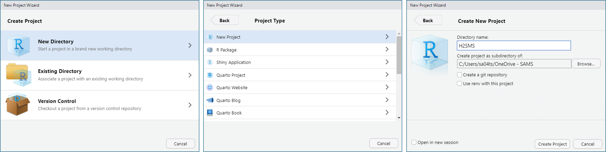
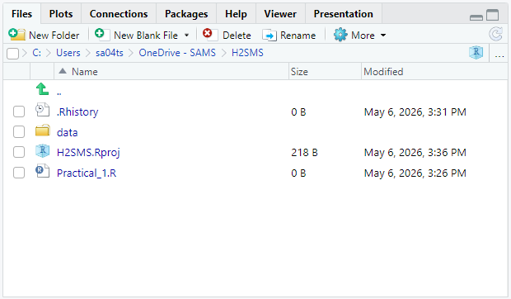

# R setup {#sec-R_setup .unnumbered}

## Getting started in R

R is a statistical language and computing platform that is widely used in the sciences. It is free and open source. We will be using it extensively. There are many resources available, including:

-   Your notes and course material from H1 Maths and Data Science (also on Brightspace \> Practicals)
-   Courses such as those from [Software Carpentry](https://swcarpentry.github.io/r-novice-gapminder/) or [Swirl](https://swirlstats.com/)
-   Online videos such as [IQUIT R](https://www.youtube.com/playlist?list=PLo1ryuEXQ0sfGqV7MMwF9SiOuxW9hjZuc)

Use these resources as needed to complement, revise, and reinforce the concepts you'll learn during this course.

During the practicals, use 'copy-and-paste' thoughtfully. R is best learned through your fingers, and working through errors, though frustrating, is an essential skill.

## RStudio Projects {#sec-RStudio_projects}

Working in a 'Project' within RStudio is the best way to avoid working directory complications. This is a very common source of frustration and errors. It also helps organize work to ensure that necessary scripts, documents, data, and output are all contained within the same folder. Other benefits include tracking your history of R commands and integrating cleanly with more sophisticated version control (e.g., git – more to come later).

### Create an R Project

We will create an R Project for the semester. During each practical, you should work within this project. To set up a new project as we need it:

1.  Sign into OneDrive, then open RStudio
2.  Select *File \> New Project...*
3.  Choose *New Directory \> New Project*
4.  Set the *Directory name* as **H2_SMS** and use the *Browse* button by *Create project as a subdirectory of:* to set a convenient location in your OneDrive folder. Click 'Create Project'.
5.  In the *Files* panel in RStudio, click the *New Folder* button and create a folder called **data**.
6.  On Brightspace, download H2SMS_practicalData.xlsx in *Practicals* and move it into your newly created **data** folder.
7.  On Brightspace, download the files in *Practicals \> Weekly qmd* and move them into the **H2_DataScience** folder.
8.  Close RStudio (to learn how to open appropriately)

{#fig-RStudioNewProject}

{#fig-RStudioDirectoryStructure}

The code in the practicals assumes this organization. If you choose to put your data files elsewhere, you will need to update the scripts accordingly. You're now prepared and organized for a semester in R!

### Opening R

When using a project, you should open R via the .proj file – *not* the script you plan to work on.

::: callout-caution
I repeat: **Open H2_SMS.Rproj** instead of the .R or .qmd file you plan to work on!
:::

This is the start-up process you should use for the practicals:

1.  Open Windows Explorer (or Finder on Mac) and find your **H2_SMS** folder.
2.  [Double click on **H2_SMS.Rproj**]{.underline}. This opens your R project with the working directory set to that folder. The working directory is shown at the top of the Console pane, and you can check it with `getwd()`. This is where R is 'situated' when loading or saving files.
3.  In the *Files* panel, open the .qmd file for the week (or your .R file if you prefer).

## RStudio Settings

You can adjust many settings in RStudio via Tools \> Global options. In the Appearance tab in the popup box, you can set the theme (e.g., if you prefer a **dark theme**), font size, etc. The Code tab has many nice features as well (e.g., **rainbow parentheses** under Display).

## R packages and libraries {#sec-R_packages}

R packages are collections of functions, custom data structures, and datasets that are developed by the user base. A new installation of R includes many useful packages, visible on the 'Packages' tab in RStudio. There are many additional packages available from the official CRAN repository or less officially from GitHub. If you find yourself re-using custom functions across projects, you can even create your own personal package.

To install a package from CRAN, use the function `install.packages("packageName")`. This downloads the package files to your computer. Each time you open R, you will need to load that package to use it with `library(packageName)`.

Installing from other package sources is slightly more complicated, so see me if you have a need.

View an overview of a package with `?packageName`, and then see a list of all of the functions by scrolling to the bottom of the help page and clicking the "index" link.

The help for each function is available with `?functionName`, and you can see the underlying code by running `functionName` without parentheses.

## R scripts (.R) vs Quarto documents (.qmd) {#sec-quarto}

In H1, you used R scripts (.R). These are just text files. The extension tells your computer to associate them with R, and also lets you run lines of code with 'ctrl + enter' and other convenient things in R and RStudio.

[Quarto documents](https://quarto.org/docs/get-started/hello/rstudio.html) (.qmd) are also text files. However, RStudio interprets the text differently, allowing you to intersperse written prose, figures, references, R code, and output in a single document (similar to a jupyter notebook or a live script in Matlab). Code is marked as "chunks" and you can specify options for how the code and output are displayed. The text uses [markdown formatting](https://quarto.org/docs/authoring/markdown-basics.html), which allows all sorts of formatting (headers, bold, italic, equations, hyperlinks, tables, images...). RStudio can render a .qmd file into many other formats (e.g., pdf, docx, html, epub...).

Code chunks can be added with the green button with a '(+)c' on the top right of a .qmd document in RStudio. Code chunks look like this:

```{r}
#| echo: fenced

# This is a code chunk
a <- 1:3
a
```

Run the full block with the green 'play' button at the top right of the block. The output from the code is shown just below the block.

For code-heavy work, Quarto documents are a handy way to produce nicely formatted output without the hassle of copying and pasting code, output, and figures into, e.g., a word document. There are many [guides](https://quarto.org/docs/guide/) and [tutorials](https://quarto.org/docs/get-started/hello/rstudio.html) online.

This manual is written as a Quarto book. **Versions of the .qmd files for each practical are available on Brightspace** to make things easier for you. You should now have these downloaded and saved in your project directory.

Note that the project will be submitted as a .qmd file with a version rendered to html.

## Writing R code

R has established best practices to make your meaning clear. Just like any language, you\|can\|write\|with\|your\|own\|system, but it's easier for everyone to use standard conventions. See the [full style guide](https://style.tidyverse.org/syntax.html) for more.

A few key points:

-   Use `<-` to *assign* a value to an object. You may see `=`, which works, but is not preferred.
-   Use `#` to write a comment which R will ignore.
-   Use spaces to make your code legible: `a <- c(1, 2, 3)`.
-   Avoid spaces in column names or file names as these are a pain to work with.
-   Use names for objects that are short, but descriptive.
-   Limit the length of a line of code to about 80 characters.
-   Usually, variables should be nouns and functions should be verbs.
-   Run the line of code where your cursor is (or everything you've selected) with ctrl + enter
